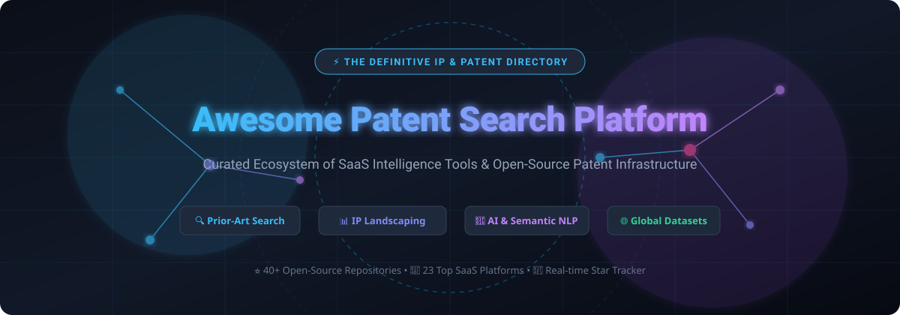

<div align="center">



# ⚡ Awesome Patent Search Platform

### 🌐 The Definitive Ecosystem of SaaS Intelligence Tools, Commercial IP Platforms & Open-Source Patent Infrastructure

<p align="center">
  <a href="https://github.com/ishandutta2007/Awesome-Awesome-Awesome"></a><a href="https://discord.gg/jc4xtF58Ve"></a>
  <a href="https://github.com/ishandutta2007/Awesome-Patent-Search-Platform/stargazers"></a>
  <a href="https://github.com/ishandutta2007/Awesome-Patent-Search-Platform/network/members"></a>
  <a href="https://github.com/ishandutta2007/Awesome-Patent-Search-Platform/issues"></a>
  <a href="https://github.com/ishandutta2007/Awesome-Patent-Search-Platform/pulls"></a>
  <a href="https://github.com/ishandutta2007/Awesome-Patent-Search-Platform/blob/main/LICENSE"></a>
  <a href="https://github.com/ishandutta2007"></a>
</p>

*Curated list focused on Patent Search, Prior-Art Discovery, Patent Landscaping, Intellectual Property (IP) Intelligence, Patent Analytics, Patent Law NLP, Semantic Search, and Patent Data Pipelines.*

**📅 Last updated: September 2026**

</div>

---

## 📌 Table of Contents

* [🔍 Overview & Ecosystem Architecture](#-overview--ecosystem-architecture)
* [💼 SaaS & Commercial Hosted Platforms](#-saas--commercial-hosted-platforms)
* [💻 Open-Source GitHub Projects](#-open-source-github-projects)
* [🛠️ Architectural Building Blocks for Custom Patent Search](#-architectural-building-blocks-for-custom-patent-search)
* [📈 Star History](#-star-history)
* [🤝 How to Contribute](#-how-to-contribute)
* [⚖️ Disclaimer](#-disclaimer)

---

## 🔍 Overview & Ecosystem Architecture

This repository tracks notable **SaaS platforms**, enterprise patent intelligence suites, public search repositories, and **open-source systems** for **Patent Search & Intellectual Property Analytics**. These technologies enable patent attorneys, patent examiners, IP analysts, corporate R&D teams, academic researchers, and machine learning engineers to:

- 🔬 **Prior-Art Discovery**: Uncover patent literature, non-patent literature (NPL), and defensive publications before filing.
- 🗺️ **Patent Landscaping**: Map technology white spaces, track competitor filing velocity, and evaluate technology domain concentration.
- 🌳 **Citation & Family Analysis**: Explore backward/forward citations, priority trees, and international patent family extensions (INPADOC).
- 🧠 **AI & Semantic Search**: Index unstructured claims, abstracts, and detailed descriptions with vector embeddings, BM25, and hybrid cross-encoders.
- 📊 **Freedom to Operate (FTO) & Validity**: Screen patent claims against infringement risks and assess patent validity.

---

## 💼 SaaS & Commercial Hosted Platforms

> 📊 **Market Size & Structure**: The global Patent Search, Intellectual Property (IP) Management, and Patent Analytics Software Market is valued at approximately **$2.1 Billion – $3.4 Billion (2025–2026)**, projected to reach **$6.8+ Billion by 2033** at a **~13.2% CAGR**. The sector exhibits **moderate fragmentation** — anchored by enterprise conglomerates (Clarivate, LexisNexis/RELX, Questel) alongside high-velocity AI-native challengers (PatSnap, IPRally) and publicly funded open-access data infrastructures (Google Patents, Lens.org, EPO Espacenet, USPTO Patent Center, WIPO PATENTSCOPE).

*Platforms are sorted below by **Company Size / Valuation / Operating Budget** in descending order:*

| 🏢 Platform | 📝 Description | 💰 Pricing | 🎁 Free Tier / Trial Limits | 📈 Company Size / Valuation |
| :--- | :--- | :--- | :--- | :--- |
| **[Google Patents](https://patents.google.com/)** | Widely used public patent search platform offering full-text patent search, patent-family information, citations, classifications, inventor and assignee discovery, and machine-readable patent data access. | Free ($0) | Free forever; unrestricted global patent search and document downloads (subject to standard automated request limits) | **~$2.1T+** Market Cap / ~$350B+ Revenue (Alphabet Inc.) |
| **[Google Patents Public Datasets](https://console.cloud.google.com/marketplace/product/google_patents_public_datasets/public_patents)** | Large-scale patent datasets available through BigQuery for SQL-based patent analysis, patent landscaping, claim analysis, and custom research workflows. | Starts at $6.25 per TB (BigQuery on-demand analysis beyond monthly free allowance) | Free forever for first 1 TB/month of query data processing under Google Cloud Free Tier | **~$2.1T+** Market Cap / ~$350B+ Revenue (Alphabet Inc.) |
| **[PatentSight](https://www.patentsight.com/)** | Patent analytics and portfolio intelligence platform emphasizing Patent Asset Index, patent value, competitive benchmarking, technology landscapes, and strategic portfolio analysis. | Starts at ~$10,000 – $20,000/year for corporate patent analytics licenses (LexisNexis IP suite) | Free guided portfolio pilot demo upon request; free PatentAdvisor browser extension for basic examiner statistics; no permanent free SaaS plan | **~$85B+** Market Cap / ~$11.5B+ Revenue (RELX Group / LexisNexis) |
| **[USPTO Patent Center](https://patentcenter.uspto.gov/)** | Official United States patent information system for accessing patent applications, prosecution information, assignment data, and related public patent records. | Free ($0) | Free forever; unrestricted public access to US patent applications, patent grants, and public prosecution history (file wrapper) documents | **~$4.2B** Annual Federal Operating Budget (USPTO) |
| **[Derwent Innovation](https://clarivate.com/derwent/)** | Enterprise patent intelligence platform from Clarivate combining global patent content, enhanced Derwent World Patents Index (DWPI) indexing, citation analysis, and IP analytics. | Starts at ~$15,000/year for entry enterprise licenses (scales with DWPI indexing and analytics modules) | Free trial / pilot demo available upon request (typically 7–14 days evaluation); no permanent free tier | **~$4.5B** Market Cap / ~$2.6B Revenue (Clarivate NYSE: CLVT) |
| **[Espacenet](https://worldwide.espacenet.com/)** | European Patent Office patent search service providing access to extensive worldwide patent documentation, bibliographic data, legal information, and INPADOC patent families. | Free (€0) | Free forever; unlimited global search across 140M+ patent documents (up to 500 results per export download; OPS API has 4 GB/week free limit) | **~€2.5B** (~$2.7B) Annual Operating Budget (EPO) |
| **[Questel Orbit Intelligence](https://www.questel.com/)** | Enterprise patent search and IP intelligence platform offering global patent databases, sophisticated search, patent family analysis, competitive monitoring, and patent analytics. | Starts at ~$3,000 – $5,000/user/year (entry commercial single-seat quote) | 15-day free trial upon request and registration; no permanent free tier | **~$1.5B – $2.0B** Valuation / ~$250M+ Revenue (Eurazeo / IK Partners) |
| **[PatSnap](https://www.patsnap.com/)** | Global patent intelligence and innovation platform providing patent search, technology landscaping, competitive intelligence, analytics, and AI-assisted research workflows. | Starts at ~$100/month (Eureka Engineering Pro / Open Platform Pro); Patent Searching Pro at ~$400/month | Free basic tier (Eureka Basic & Open Platform Starter with 10,000 API credits, ~10 searches/month); 7-day free trial on select modules | **~$1.0B+** Valuation (Unicorn; SoftBank & Tencent backed) / ~$100M+ ARR |
| **[STN](https://www.cas.org/solutions/stn)** | Professional scientific and patent information platform supporting complex searches across patents, scientific literature, chemistry, CAS REGISTRY, and technical information. | Connect time starting at ~$100 – $300/connect hour plus file search/display fees ($2–$10+ per record) | Free assisted demo via CAS; free command syntax checks (`EXPAND`) and sample training database files; no permanent free tier | **~$650M+** Annual Revenue (CAS / American Chemical Society) |
| **[WIPO PATENTSCOPE](https://patentscope.wipo.int/)** | Global patent information platform from WIPO supporting searches across PCT applications and participating national and regional patent collections. | Free ($0) | Free forever; unlimited search across 115M+ patent records, up to 10,000 records exportable per search | **~CHF 450M** (~$500M) Operating Budget (WIPO / UN) |
| **[IFI CLAIMS Patent Services](https://www.ificlaims.com/)** | Patent data and intellectual-property intelligence provider offering structured patent information, CLAIMS Direct API, patent search, analytics, and enterprise data products. | Starts at ~$10,000/year for direct API subscriptions; BigQuery access at standard $6.25/TB | Free trial access provided for API testing upon request; free public bibliographic dataset table on Google BigQuery (up to 1 TB/month free queries) | **~$2.0B+** Parent Revenue (Digital Science / Holtzbrinck) / ~$15M Unit |
| **[PatBase](https://www.patbase.com/)** | Global patent database and search platform providing professional patent searching, family information, monitoring, alerts, and patent analytics. | Starts at ~$4,000 – $6,000/user/year (approx. £3,000–£4,500/year for single seat) | 14-day free trial for PatBase (7-day free trial for PatBase Express); no permanent free tier | **~$30M – $50M** Revenue (Minesoft / Metric Capital Partners) |
| **[IP.com](https://www.ip.com/)** | Intellectual-property intelligence platform offering prior-art search, patent search, technical disclosure management, innovation intelligence, and IP research services. | Starts at $49/user/month (InnovationQ Plus Basic); Prior Art Database defensive publishing from $195/disclosure | 2-day free trial for search platform; free public searching of the IP.com Prior Art Database | **~$15M – $30M** Annual Revenue |
| **[InnovationQ Plus](https://www.ip.com/innovationq-plus/)** | AI-assisted patent and prior-art search platform powered by ConceptQuery designed to help researchers discover relevant technical documents and intellectual-property information. | Starts at $49/user/month (Basic plan) or $199/user/month (Premium plan / Day Pass) | 2-day free trial with platform feature access upon registration; no permanent free tier | **~$15M – $30M** Annual Revenue (IP.com platform) |
| **[Gridlogics PatSeer](https://patseer.com/)** | Patent research and analytics platform focused on prior-art search, patent landscaping, competitive intelligence, portfolio analysis, and technology monitoring. | Starts at ~$900/user/quarter (~$300/user/month or ~$3,600/year for Explorer/Premier base tier) | 14-day free trial (no credit card required); no permanent free tier | **~$10M – $15M** Annual Revenue (Gridlogics) |
| **[PatSeer Pro](https://patseer.com/)** | Advanced patent intelligence environment supporting complex patent queries, analytics, technology landscapes, portfolio evaluation, and competitive monitoring. | Starts at ~$1,200/user/quarter (~$400/user/month for ProX edition with advanced analytics) | 14-day free trial (no credit card required); no permanent free tier | **~$10M – $15M** Annual Revenue (Gridlogics) |
| **[The Lens](https://www.lens.org/)** | Patent and scholarly knowledge platform supporting structured patent search, classification search, filtering, collections, alerts, visualizations, and links between patents and scholarly literature. | Free for non-commercial/academic use; Commercial licenses start at $1,000/year (~$83.33/month) | Free forever for non-commercial and individual research (unlimited searching, up to 10,000 items in saved collections, alerts); 14-day free trial for patent API | **~$5M – $10M** Annual Budget (Cambia Non-Profit Initiative) |
| **[IPRally](https://www.iprally.com/)** | AI-powered patent intelligence platform focused on prior-art discovery and technology intelligence using graph neural networks and semantic machine learning. | Starts at €3,000/year (~€250/month) for individual plan; team plans scale to $24,000+/year | 3-day free trial with AI graph search capabilities; no permanent free tier | **~$30M – $50M** Valuation (Series A / ~$15M raised) / ~$5M ARR |
| **[Patent Field](https://patentfield.com/)** | Japanese & global patent search and analysis service focused on AI semantic search, visual landscape clustering, and technology intelligence. | Starts at ¥10,000/month (~$70/month; ¥100,000/year on annual plan) | Free forever tier limited to 20 searches per month with basic AI search and classification features | **~$5M – $10M** Valuation / ~$2M–$5M ARR |
| **[FreePatentsOnline](https://www.freepatentsonline.com/)** | Public patent search service providing searchable patent documents and patent-related information across major patent jurisdictions. | Free ($0 for web search engine); optional SearchAlerts/bulk services start at ~$15/month | Free forever with unlimited patent search, full-text viewing, and single PDF downloads across US, EP, JP, and PCT documents | **~$1M – $5M** Annual Revenue (SumoBrain Solutions) |
| **[Ambercite](https://www.ambercite.com/)** | Patent citation-search and prior-art discovery platform focused on citation networks, related-document discovery, and identifying relevant patent literature. | Starts at ~$1,500 – $2,500/year for small firm / consultant licenses | 21-day or 20-search free trial (limited to top 25 results with 5 obscured, max 3 input patents, no Excel exports); no permanent free tier | **~$1M – $5M** Annual Revenue |
| **[PatentInspiration](https://www.patentinspiration.com/)** | Patent search and innovation intelligence platform focused on visual patent exploration, semantic discovery, technology landscapes, and competitive intelligence. | Starts at €99/month (Basic plan; Team at €199/month, Enterprise at €499/month) | Free forever tier (basic searches and visualization, watermarked images, limited report saving); 7-day full-featured free trial | **~$1M – $3M** Annual Revenue (AULIVE) |
| **[PatentBuddy](https://www.patentbuddy.com/)** | Patent search and patent portfolio intelligence service providing access to patent information, prosecution data, and patent-related analytics. | Starts at $29.95/month for Pro/Premium analytics tier (basic portal is free) | Free forever tier for standard US patent application searches, inventor profiles, and assignee summaries | **<$2M** Annual Revenue |

---

## 💻 Open-Source GitHub Projects

*Open-source repositories and infrastructure for building custom patent search engines, patent data ETL pipelines, semantic vector search, claim analysis, and citation knowledge graphs.*

*All repositories are sorted below by **GitHub Star Count** in descending order:*

1. **[Hugging Face Transformers](https://github.com/huggingface/transformers)** [](https://github.com/huggingface/transformers/stargazers)
   State-of-the-art Machine Learning for PyTorch, TensorFlow, and JAX. Core framework for fine-tuning transformer models (e.g. PatentBERT, SciBERT) for patent classification, claim summarization, entity extraction, and prior-art retrieval.

2. **[LangChain](https://github.com/langchain-ai/langchain)** [](https://github.com/langchain-ai/langchain/stargazers)
   Framework for developing applications powered by language models, autonomous agents, and RAG pipelines connected to patent databases, USPTO APIs, and claim analysis tools.

3. **[RAGFlow](https://github.com/infiniflow/ragflow)** [](https://github.com/infiniflow/ragflow/stargazers)
   Open-source RAG engine based on deep document understanding for complex multi-page patent PDFs, engineering drawings, tables, and claim tree hierarchies.

4. **[Elasticsearch](https://github.com/elastic/elasticsearch)** [](https://github.com/elastic/elasticsearch/stargazers)
   Distributed search and analytics engine widely used for large-scale structured patent metadata, BM25 text indexing, IPC/CPC classification filtering, and prior-art queries.

5. **[Apache Superset](https://github.com/apache/superset)** [](https://github.com/apache/superset/stargazers)
   Enterprise data exploration and visualization platform to build interactive patent filing trend dashboards, technology landscape heatmaps, and corporate portfolio charts.

6. **[Meilisearch](https://github.com/meilisearch/meilisearch)** [](https://github.com/meilisearch/meilisearch/stargazers)
   Lightning-fast, typo-tolerant open-source search engine tailored for instant, responsive web interfaces searching patent titles, abstracts, inventors, and assignees.

7. **[LlamaIndex](https://github.com/run-llama/llama_index)** [](https://github.com/run-llama/llama_index/stargazers)
   Data framework for LLM applications. Provides specialized document loaders and indexing structures for hierarchical patent claim trees, description cross-referencing, and conversational patent research.

8. **[Metabase](https://github.com/metabase/metabase)** [](https://github.com/metabase/metabase/stargazers)
   User-friendly open-source business intelligence tool to query and visualize patent databases, filing trends by jurisdiction, and assignee portfolio statistics.

9. **[Milvus](https://github.com/milvus-io/milvus)** [](https://github.com/milvus-io/milvus/stargazers)
   Cloud-native, open-source vector database built for massive-scale embedding indexing, enabling billion-scale similarity search across global patent descriptions and claims.

10. **[FAISS](https://github.com/facebookresearch/faiss)** [](https://github.com/facebookresearch/faiss/stargazers)
    Open-source similarity search library for dense vector embeddings, providing high-performance GPU and CPU nearest-neighbor search for patent prior-art discovery.

11. **[Qdrant](https://github.com/qdrant/qdrant)** [](https://github.com/qdrant/qdrant/stargazers)
    Vector similarity search engine and vector database written in Rust with rich payload filtering, ideal for semantic patent search combined with strict IPC classification and date range filters.

12. **[spaCy](https://github.com/explosion/spaCy)** [](https://github.com/explosion/spaCy/stargazers)
    Industrial-strength NLP in Python for patent named entity recognition (NER), technical terminology extraction, dependency parsing, and claim structure breakdown.

13. **[Chroma](https://github.com/chroma-core/chroma)** [](https://github.com/chroma-core/chroma/stargazers)
    AI-native open-source embedding database for rapid prototyping of semantic patent search tools, local RAG assistants, and prior-art discovery applications.

14. **[Typesense](https://github.com/typesense/typesense)** [](https://github.com/typesense/typesense/stargazers)
    Fast, typo-tolerant in-memory search engine providing out-of-the-box instant search experiences for patent catalogs, assignee lookups, and classification browsing.

15. **[Haystack](https://github.com/deepset-ai/haystack)** [](https://github.com/deepset-ai/haystack/stargazers)
    Modular end-to-end framework for building custom patent search pipelines, combining BM25 sparse retrieval, dense neural vector search, cross-encoder rerankers, and LLM QA.

16. **[Sentence Transformers](https://github.com/UKPLab/sentence-transformers)** [](https://github.com/UKPLab/sentence-transformers/stargazers)
    Framework for generating high-quality dense embeddings for patent abstracts, claims, and technical concepts for semantic similarity and prior-art search.

17. **[NetworkX](https://github.com/networkx/networkx)** [](https://github.com/networkx/networkx/stargazers)
    Python package for analyzing complex networks, useful for patent backward/forward citation graphs, inventor collaboration networks, and assignee ownership mapping.

18. **[Neo4j Community Edition](https://github.com/neo4j/neo4j)** [](https://github.com/neo4j/neo4j/stargazers)
    Graph database platform for constructing interconnected patent knowledge graphs linking patent families, citations, classifications, assignees, and technology clusters.

19. **[Weaviate](https://github.com/weaviate/weaviate)** [](https://github.com/weaviate/weaviate/stargazers)
    Open-source vector database featuring native hybrid search (BM25 + dense vectors) and multi-modal search across patent text and technical schematic diagrams.

20. **[Jupyter Notebook / JupyterLab](https://github.com/jupyter/jupyter)** [](https://github.com/jupyter/jupyter/stargazers)
    Interactive computational environment widely used by patent data scientists for reproducible patent landscaping, data wrangling, and exploratory bibliometric research.

21. **[OpenSearch](https://github.com/opensearch-project/OpenSearch)** [](https://github.com/opensearch-project/OpenSearch/stargazers)
    100% open-source distributed search engine with built-in k-NN vector search and neural search plugins, perfect for self-hosted enterprise patent repositories.

22. **[txtai](https://github.com/neuml/txtai)** [](https://github.com/neuml/txtai/stargazers)
    All-in-one open-source embeddings database for semantic search, LLM orchestration, and graph-assisted patent intelligence workflows.

23. **[BERTopic](https://github.com/MaartenGr/BERTopic)** [](https://github.com/MaartenGr/BERTopic/stargazers)
    Topic modeling technique leveraging transformer embeddings and c-TF-IDF to automatically discover, cluster, and track emerging technology trends across patent corpuses.

24. **[Vespa](https://github.com/vespa-engine/vespa)** [](https://github.com/vespa-engine/vespa/stargazers)
    Open-source big-data serving engine for real-time ranking, vector search, multi-phase retrieval, and complex query execution over vast patent collections.

25. **[Gephi](https://github.com/gephi/gephi)** [](https://github.com/gephi/gephi/stargazers)
    Open-source visualization software for exploring large-scale patent citation networks, technology diffusion maps, and inventor collaboration structures.

26. **[GROBID](https://github.com/kermitt2/grobid)** [](https://github.com/kermitt2/grobid/stargazers)
    Machine learning library for extracting, parsing, and restructuring patent citations and scientific PDF documents into structured XML representations.

27. **[Apache Lucene](https://github.com/apache/lucene)** [](https://github.com/apache/lucene/stargazers)
    High-performance, full-featured search library powering global patent databases with advanced Boolean logic, proximity operators, and field-specific indexing.

28. **[Pyserini](https://github.com/castorini/pyserini)** [](https://github.com/castorini/pyserini/stargazers)
    Python toolkit for reproducible information retrieval, providing sparse BM25 and dense bi-encoder indexing across benchmark patent test collections (e.g., CLEF-IP).

29. **[Apache Solr](https://github.com/apache/solr)** [](https://github.com/apache/solr/stargazers)
    Enterprise search platform built on Apache Lucene, widely deployed for faceted searching, filtering, highlighting, and geospatial queries across global patent portfolios.

30. **[Google Patents Public Data](https://github.com/google/patents-public-data)** [](https://github.com/google/patents-public-data/stargazers)
    Open-source analysis workflows, automated patent landscaping, claim extraction, and machine-learning-based claim breadth analysis scripts using BigQuery patent tables.

31. **[python-epo-ops-client](https://github.com/ip-tools/python-epo-ops-client)** [](https://github.com/ip-tools/python-epo-ops-client/stargazers)
    Apache-licensed Python client library for accessing the European Patent Office Open Patent Services (EPO OPS) API with automatic quota management and caching.

32. **[PQAI (Patent Quality AI)](https://github.com/pqaidevteam/pqai)** [](https://github.com/pqaidevteam/pqai/stargazers)
    Open-source AI-assisted patent prior-art and semantic similarity search engine ecosystem designed to improve patent examination and discovery.

33. **[PatZilla](https://github.com/ip-tools/patzilla)** [](https://github.com/ip-tools/patzilla/stargazers)
    Modular open-source patent research platform and data integration toolkit with a modern web UI, command-line tooling, and connectors to EPO OPS and public sources.

34. **[Awesome Patent Retrieval](https://github.com/mahesh-maan/awesome-patent-retrieval)** [](https://github.com/mahesh-maan/awesome-patent-retrieval/stargazers)
    Curated list of patent retrieval research papers, search engine benchmarks, open datasets, and evaluation metrics for patent discovery.

35. **[OPS Patent Search MCP](https://github.com/navisbio/OPS-patent-search-mcp)** [](https://github.com/navisbio/OPS-patent-search-mcp/stargazers)
    Model Context Protocol (MCP) server for querying EPO Open Patent Services directly from AI coding assistants and LLM agent frameworks.

36. **[Lens API Documentation & Examples](https://github.com/lens-org/lens-api-doc)** [](https://github.com/lens-org/lens-api-doc/stargazers)
    Official open-source API documentation, notebooks, and code samples in Python, R, Java, and Node.js for searching patent and scholarly data from The Lens.

37. **[WIPO Analytics Manual](https://github.com/wipo-analytics/manual)** [](https://github.com/wipo-analytics/manual/stargazers)
    Open educational repository by the World Intellectual Property Organization (WIPO) demonstrating reproducible patent analytics workflows, indicators, and cleaning routines.

38. **[EPO OPS Go Client](https://github.com/patent-dev/epo-ops)** [](https://github.com/patent-dev/epo-ops/stargazers)
    High-performance Go client library for the European Patent Office OPS API supporting bibliographic data, claims, legal status, and CQL queries.

39. **[Node.js EPO OPS Client](https://github.com/sujith3g/epo-ops)** [](https://github.com/sujith3g/epo-ops/stargazers)
    JavaScript/Node.js wrapper for searching and retrieving patent bibliographic publications and patent families from the EPO Open Patent Services API.

40. **[Google Patent CLI](https://github.com/sonesuke/google-patent-cli)** [](https://github.com/sonesuke/google-patent-cli/stargazers)
    Command-line and AI-agent tool to query and retrieve structured patent data (abstracts, claims, descriptions, assignees) directly from Google Patents.

41. **[PatentsView to BigQuery](https://github.com/Innovation-Information-Initiative/bigquery_patentsview)** [](https://github.com/Innovation-Information-Initiative/bigquery_patentsview/stargazers)
    Open-source data engineering pipeline to ingest USPTO PatentsView TSV data, convert to Parquet, and load structured tables into Google BigQuery for high-speed SQL analytics.

42. **[PatentsView API](https://github.com/USPTO/PatentsView-API)** [](https://github.com/USPTO/PatentsView-API/stargazers)
    USPTO open-data platform repository providing structured access to patent metadata, disambiguated inventor entities, and assignee profiles.

---

## 🛠️ Architectural Building Blocks for Custom Patent Search

To construct a production-ready, self-hosted patent intelligence and prior-art search system, combine the following layers:

```
┌─────────────────────────────────────────────────────────────┐
│               User Interface & Analytics Layer               │
│      (React / Next.js / Streamlit / Apache Superset / Metabase)│
└──────────────────────────────┬──────────────────────────────┘
                               │
┌──────────────────────────────▼──────────────────────────────┐
│                  AI & Orchestration Engine                  │
│       (LangChain / LlamaIndex / Haystack / RAGFlow / txtai) │
└──────────────┬───────────────────────────────┬──────────────┘
               │                               │
┌──────────────▼──────────────┐ ┌──────────────▼──────────────┐
│  Keyword & Metadata Search  │ │  Semantic Vector Search     │
│ (OpenSearch / Elasticsearch/│ │(Qdrant / Milvus / FAISS /   │
│  Typesense / Apache Solr)   │ │ Weaviate / Chroma)          │
└──────────────┬──────────────┘ └──────────────┬──────────────┘
               │                               │
┌──────────────▼───────────────────────────────▼──────────────┐
│               Data Acquisition & Ingestion Pipeline          │
│   (EPO OPS Clients / USPTO PatentsView / BigQuery Datasets) │
└─────────────────────────────────────────────────────────────┘
```

1. 📥 **Data Acquisition & Ingestion**:
   - **Programmatic APIs**: Use `python-epo-ops-client`, `epo-ops` Go client, or `PatZilla` connectors for EPO records.
   - **Bulk Open Data**: Ingest USPTO PatentsView datasets and Google Patents Public Datasets on BigQuery.
2. 🔎 **Hybrid Search Layer**:
   - **Lexical/Sparse**: Deploy OpenSearch, Elasticsearch, or Typesense for exact keyword, CPC classification, and Boolean queries.
   - **Dense/Vector**: Deploy Qdrant, Milvus, Weaviate, or FAISS with Sentence Transformers (or domain-adapted PatentBERT) for semantic prior-art discovery.
3. 🕸️ **Knowledge Graph & Citations**:
   - Utilize Neo4j or NetworkX to construct patent citation networks, assignee parent-subsidiary mappings, and inventor graphs.
4. 📊 **Landscaping & Dashboards**:
   - Deploy Apache Superset, Metabase, or Jupyter notebooks with BERTopic to visualize technology whitespace clusters and filing velocity.

---

## 📈 Star History

[](https://star-history.dera.page/#ishandutta2007/Awesome-Patent-Search-Platform&type=date&legend=top-left)

---

## 🤝 How to Contribute

Contributions are welcome! Please follow these guidelines:

1. 🍴 **Fork the repository**.
2. 🌿 **Create a new branch**: `git checkout -b add-my-patent-tool`.
3. 📝 **Add your entry** matching the existing format.
4. 🔗 **Include**: Platform name, official URL, concise description, specific pricing, and free tier limits.
5. 🚀 **Submit a Pull Request** with a brief summary of the addition.

---

## ⚖️ Disclaimer

* This repository is **community-curated** for informational, research, and educational purposes only.
* Patent search results, automated similarity matches, and AI-generated claim comparisons **do not constitute legal advice** and should not replace professional Freedom to Operate (FTO), patentability, or invalidity analyses by registered patent attorneys or patent agents.
* Database coverage, update frequencies, full-text OCR accuracy, and legal status changes vary across patent offices and commercial vendors.

---

<div align="center">
  <b>Made with ❤️ for patent attorneys, IP analysts, researchers, R&D innovators, and open-source developers.</b><br>
  <sub>Let's make patent research more open, transparent, and intelligent through open technology.</sub>
</div>
